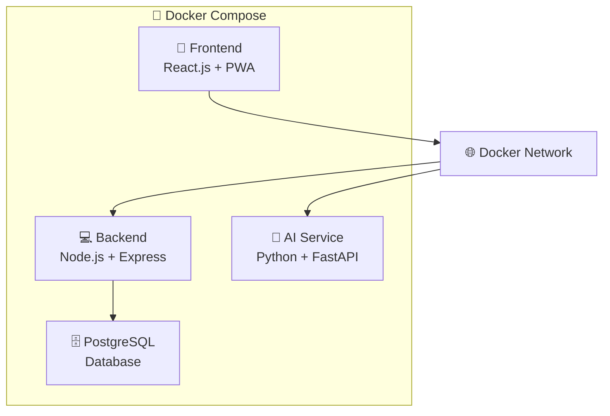

# 🤖 동행 (donghang) - 고령층을 위한 음성 기반 생활 관리 플랫폼

<div align="center">
  
  
  
  
  
  
</div>

## 📋 프로젝트 개요

**동행**은 디지털 소외계층인 고령층을 위한 **음성 우선 인터페이스** 기반의 종합 생활 관리 플랫폼입니다.

### 🚀 배포 정보
- **실제 서비스**: http://43.202.222.156:3010
- **배포 환경**: AWS EC2 t3.large + Docker Compose
- **서비스 포트**: Frontend(3010), Backend(9090), AI(8010), DB(5432)

### 🎯 주요 기능
- 🎤 **음성 기반 소비 관리**: 말로 간편하게 가계부 작성
- 🤖 **AI 챗봇 상담**: 건강, 복지 관련 24시간 상담 서비스
- 📋 **복지 서비스 예약**: 가사돌봄, 간병서비스 등 통합 예약
- 📱 **PWA 지원**: 앱스토어 없이 모바일 앱처럼 사용
- 🔒 **생체인증**: 지문, 얼굴인식으로 간편 로그인

### 🌟 차별화 포인트
- **고령층 맞춤 UI/UX**: 큰 글씨, 간단한 버튼, 직관적 네비게이션
- **음성 우선 설계**: 터치 조작 최소화
- **통합 서비스**: 여러 앱을 설치할 필요 없는 올인원 솔루션

## 🏗️ 시스템 아키텍처



### 🔧 기술 스택
- **Frontend**: React.js 18.3.1, PWA, Web Speech API
- **Backend**: Node.js 20.x, Express.js, Sequelize ORM, JWT
- **Database**: PostgreSQL 15
- **AI Service**: Python 3.9+, FastAPI, Transformers
- **DevOps**: Docker, AWS EC2

## 📁 프로젝트 구조

```
donghang_f/
├── 📱 frontend-main/     # React.js 프론트엔드
├── 💻 backend-main/      # Node.js 백엔드  
├── 🤖 AI-main/           # Python AI 서비스
├── 📊 logs/              # 로그 파일
└── 🐳 docker-compose.yml # Docker 설정
```

## 🚀 빠른 시작

### 1️⃣ 저장소 클론
```bash
git clone https://github.com/your-username/donghang_f.git
cd donghang_f
```

### 2️⃣ 환경변수 설정
```bash
# 각 서비스별 .env 파일 생성
cp backend-main/.env.example backend-main/.env
cp frontend-main/.env.example frontend-main/.env  
cp AI-main/.env.example AI-main/.env
```

### 3️⃣ Docker 실행
```bash
# 전체 서비스 시작
docker-compose up -d

# 상태 확인
docker-compose ps
```

### 4️⃣ 접속 확인
- **프론트엔드**: http://localhost:3010
- **백엔드 API**: http://localhost:9090
- **AI 서비스**: http://localhost:8010/docs

## 📊 주요 API 엔드포인트

### 인증
- `POST /api/v1/auth/login/normal` - 일반 로그인
- `POST /api/v1/auth/register` - 회원가입

### 소비 관리
- `GET /api/v1/consumption` - 소비 내역 조회
- `POST /api/v1/consumption` - 소비 기록 추가

### 복지 서비스
- `GET /api/v1/welfare` - 복지 서비스 목록
- `POST /api/v1/welfare/reservation` - 서비스 예약

### AI 챗봇
- `GET /api/v1/chatbot/chatting` - 챗봇 대화

## 👥 개발팀

- **강건우**: 프로젝트 매니저, 프론트엔드, 백엔드 개발, AI 개발
- **김우중**: 프론트엔드, AI 개발, QA

### 📧 연락처
- **이메일**: rkdrjdsn1000@naver.com

## 🙏 오픈소스 라이브러리

- **React.js** - UI 프레임워크
- **Node.js & Express** - 백엔드 서버
- **PostgreSQL** - 데이터베이스
- **FastAPI** - AI 서비스 API
- **Transformers** - 자연어 처리
